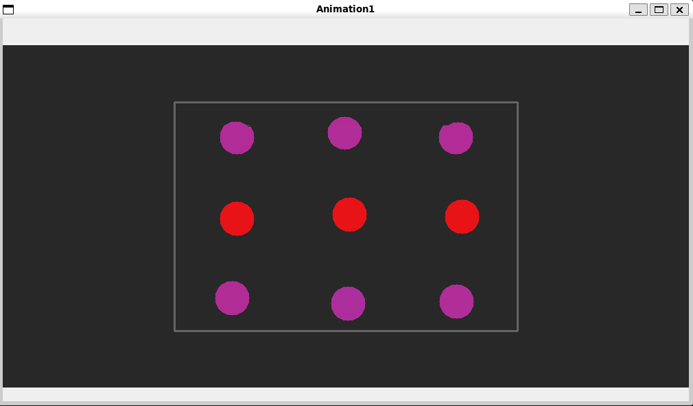
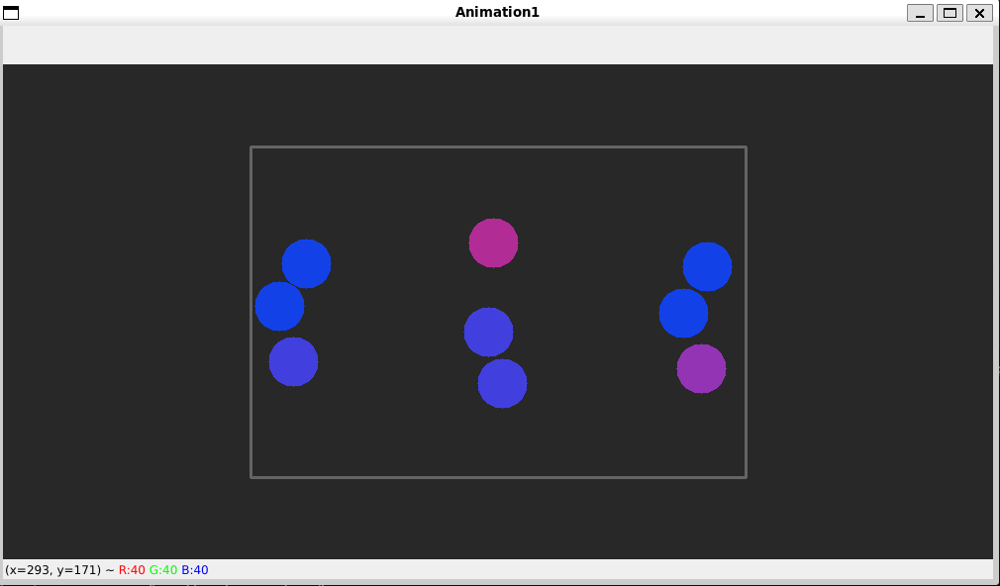
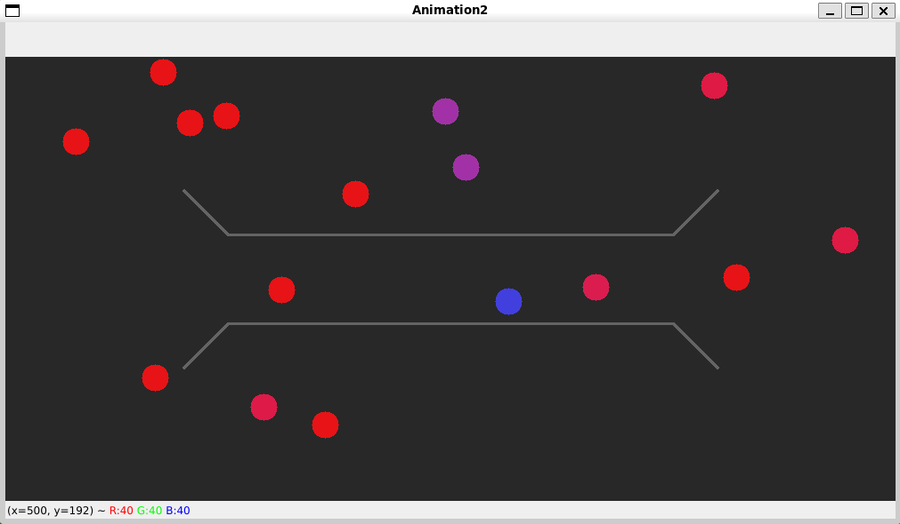
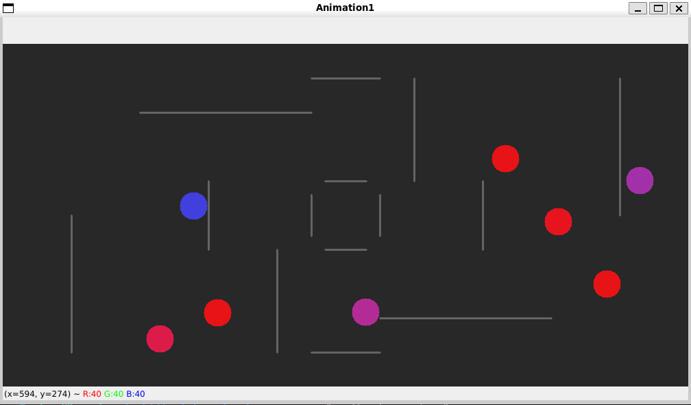
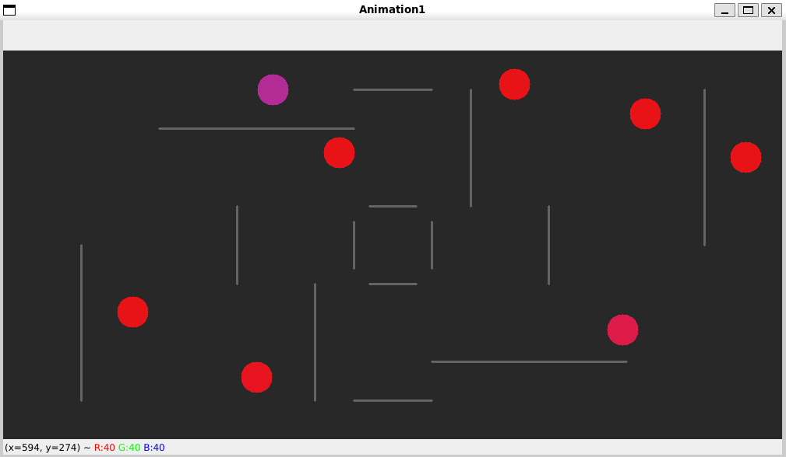

# Description
This is a simple physics engine built using the OpenCV library in Python. The engine simulates the collision between balls and walls, and it also adds a fun twist by animating the color of the balls upon collision.
# Usage
To run a simulation use the `run` function from the `engine.py` file. It takes a list of objects, which are instances of either `Ball` class or `Wall` class, the title, and some animation parameters like screen size etc. 
```py
from engine import run
run(
    objects, 
    "Animation1", 
    (height * unit_length, width * unit_length, 3),
    10.0,
    120,
    unit_length,
)
```
You can create a scene using walls and populate it with moving objects to simulate real world motion.
# Examples
### Animation 1


### Animation 2

### Animation 3

